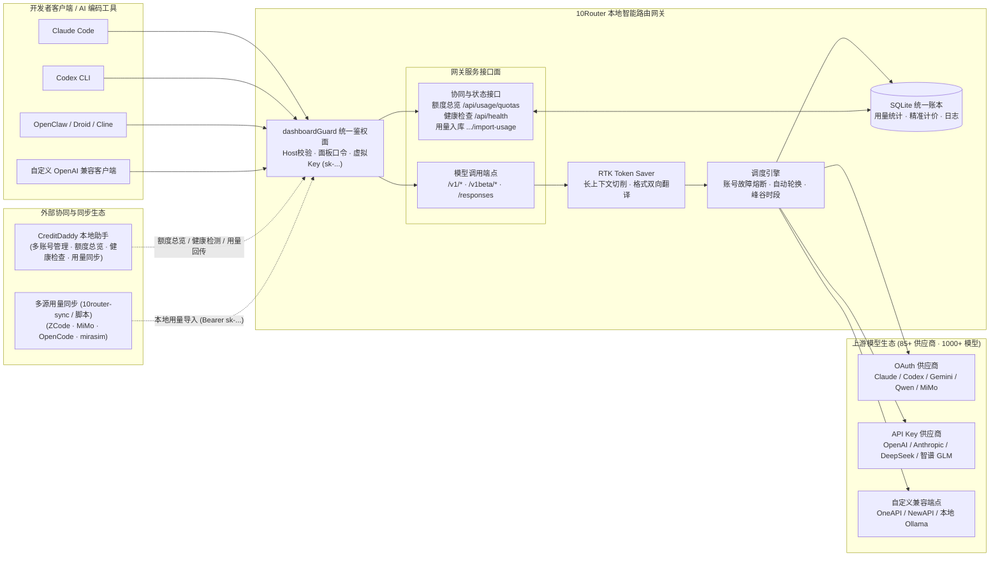

<div align="center">


# 10Router

**本地智能 AI 路由网关与用量仪表盘：单一端点统一接入 85+ 供应商 · 1000+ 模型，内置 RTK 智能压缩、多格式实时翻译、故障自动降级与用量精准计价**

[](https://github.com/techysy/10router/releases/latest)
[](https://github.com/techysy/10router/actions/workflows/test.yml)
[](https://github.com/techysy/10router/releases)
[](https://www.npmjs.com/package/@techysy/10router)
[](https://github.com/techysy/10router/pkgs/container/10router)
[](#下载)
[](https://nodejs.org/)
[](LICENSE)

[下载](#下载) · [功能](#功能) · [架构](#架构) · [快速开始](#快速开始) · [用量同步插件](#用量同步插件10router-sync) · [同步上游](#同步上游) · [项目结构](#项目结构) · [更新日志](CHANGELOG.md)


</div>

> 基于 [decolua/9router](https://github.com/decolua/9router) v0.5.55 的本地优化快照。  
> 保持单一干净 commit 历史，无上游提交污染；上游新功能一律学习理解后自行重写落地。

---

## 下载

从 [**Releases**](https://github.com/techysy/10router/releases/latest) 下载对应平台的安装包与二进制产物：

| 平台 | 文件名模式 | 说明 |
| --- | --- | --- |
| Windows | `10Router.Setup.<版本>.exe` | 安装版（推荐），自带桌面托盘 |
| Windows | `10Router-Portable-<版本>.exe` | 便携版，免安装双击运行 |
| Windows | `10Router-Web-Setup-<版本>.exe` | 在线安装器微端（轻量分发） |
| macOS（Apple Silicon） | `10Router-<版本>-arm64.dmg` | M1 / M2 / M3 / M4 芯片 |
| macOS（Intel） | `10Router-<版本>-x64.dmg` | Intel 处理器机型 |
| 飞牛 fnOS（x86） | `10router-<版本>-x86.fpk` | URL 模式桌面图标（打开浏览器） |
| 飞牛 fnOS（x86） | `10router-<版本>-iframe-x86.fpk` | 内嵌桌面窗口模式（推荐桌面体验） |
| 飞牛 fnOS（ARM） | `10router-<版本>-arm.fpk` | ARM 架构 URL 模式 |
| 飞牛 fnOS（ARM） | `10router-<版本>-iframe-arm.fpk` | ARM 架构内嵌窗口模式 |
| Linux / 通用 Server | `10router-server.tar.gz` | Standalone 服务端归档（Node 运行时部署） |
| Docker 镜像 | `ghcr.io/techysy/10router:latest` | 支持 `linux/amd64` 与 `linux/arm64` |

> 💡 **安全与系统提示**：
> - **macOS**：安装包暂未购买开发者证书签名。首次打开若提示无法验证开发者，请在「系统设置 → 隐私与安全性」中点击「仍要打开」，或在终端执行 `xattr -cr /Applications/10Router.app`。
> - **飞牛 fnOS**：应用中心支持「应用设置」直接重置登录密码，防止误触开启登录验证被锁死。

---

## 架构



---

## 功能

**统一路由与协议抹平**
- **全格式双向翻译**：统一暴露出标准的 OpenAI 兼容端点（`/v1/chat/completions`、`/v1/models`、`/v1/embeddings`），Claude / Anthropic 原生请求同端口无缝识别并自动互转。
- **85+ 供应商与 1000+ 模型**：开箱支持官方 Claude、OpenAI、DeepSeek、智谱 GLM、MiniMax、Kimi、通义千问、小米 MiMo、SiliconFlow 等主流生态。
- **RTK 智能 Token 节省引擎**：智能压缩裁剪冗余上下文及高频 `tool_result`，大幅降低大模型对话与 Agent 连续调用消耗。
- **超长上下文自动处理**：针对模型设定真实的上下文上限与最大输出值，服务端自动实施滑动窗口切削与上下文压缩。

**多账号轮换与高可用熔断**
- **双重故障降级（Fallback）**：支持同供应商多账号轮询与主备无缝切换；支持配置跨供应商多模型降级链，遇到上游 429 限流或服务不可用时秒级自动下摆。
- **渠道级智能熔断**：捕获上游错误码（如 Qoder `10605` 排队限流、渠道失效等）并映射为标准限流语义，触发冷却退避，防止任务盲目重试产生无效账单。
- **OAuth 会话无缝管理**：支持全供应商 OAuth 凭据的安全导入与加密导出（AES-GCM），账号状态、Token 自动刷新全后台静默托管。
- **跨账号「配额包到期优先」调度**：自动按活动额度过期日排序分发请求，避免赠送积分过期浪费。

**精准用量统计与生态协同**
- **多维度计费与成本热力图**：内置全系主流模型官方精确标价表（Qwen 旗舰、MiMo 等），自动计算输入、输出与缓存命中成本，展示多维热力图、健康度与生涯报表。
- **CreditDaddy 深度协同**：原生暴露只读额度总览接口（`GET /api/usage/quotas`，支持仪表盘虚拟 Key 免明文鉴权），支持向 CreditDaddy 统一反馈配额水位。
- **ZCode 插件（10router-sync）跨宿主同步**：打通 ZCode、OpenCode、mirasim、小米 MiMo 与外部 10Router 实例的本地用量，支持断点续传、自动计价估算与重复数据签名拦截。

---

## 快速开始

### 方式一：npm 全局安装（命令行推荐）

要求 **Node.js ≥ 18**：

```bash
npm i -g @techysy/10router
10router
```

启动成功后，管理仪表盘默认位于 `http://localhost:20128`。

> ⚠️ 注意：npm 官方包名为 **`@techysy/10router`**（带组织作用域），请勿安装无作用域的同名第三方包。  
> 💡 若 npm 11+ 提示 `allow-scripts` 警告，可通过 `npm install -g --allow-scripts=@techysy/10router` 消除，跳过此提示亦不影响使用（启动时会自动按需补全 SQLite 驱动）。

### 方式二：Docker 容器部署

```bash
docker pull ghcr.io/techysy/10router:latest
docker run -d \
  --name 10router \
  -p 20128:20128 \
  -v ~/.10router:/app/data \
  ghcr.io/techysy/10router:latest
```

支持 `linux/amd64` 和 `linux/arm64` 架构。

> 💡 **内网容器互联（Issue #25）**：  
> 默认开启 SSRF 私网拦截。若需要在 Docker 内部打通其他私网代理服务，可注入环境变量放行：
> - `ALLOW_PRIVATE_HOSTS=1`：放行全部内网私有地址；
> - `PRIVATE_HOST_ALLOWLIST=cli-proxy-api-plus,host.docker.internal`：指定内网域名白名单。

### 方式三：飞牛 fnOS 应用包安装

1. 从 [Releases](https://github.com/techysy/10router/releases/latest) 下载对应架构的 `.fpk` 文件（推荐内嵌窗口版 `10router-<版本>-iframe-<架构>.fpk`）。
2. 在飞牛 fnOS「应用中心」点击「手动安装」，选定文件按引导完成安装。
3. 忘记面板密码时，可在 fnOS「应用中心 → 10Router → 应用设置」直接输入新密码重置保存。

### 方式四：Standalone 服务包部署

适用于无需完整构建源码的轻量 Linux 服务器：

```bash
tar xzf 10router-server.tar.gz -C /opt/10router
cd /opt/10router
node custom-server.js --port 20128
```

### 方式五：从源码开发与构建

```bash
git clone https://github.com/techysy/10router.git
cd 10router
cp .env.example .env
npm install
PORT=20128 npm run dev        # 启动热重载开发模式
```

生产打包：

```bash
npm run build
PORT=20128 HOSTNAME=0.0.0.0 npm run start
```

---

## 客户端接入示例

启动 10Router 后，直接在各类 CLI、插件或 Agent 中配置网关地址：

### Claude Code CLI
```bash
export ANTHROPIC_BASE_URL="http://localhost:20128"
export ANTHROPIC_API_KEY="sk-any-key"  # 10Router 仪表盘配置的 Key 或虚拟 Key
claude
```

### OpenAI 兼容客户端（Cursor / Cline / Roo Code / OpenClaw 等）
- **Base URL**: `http://localhost:20128/v1`
- **API Key**: 仪表盘创建的访问密钥（支持按渠道细粒度授权）
- **Model**: 直接填写模型 ID 或 10Router 自定义的别名组合名（如 `my-fast-model`）

---

## 🔌 用量同步插件（10router-sync）

10Router 仓库附带官方用量同步插件（位于 `zcode-plugin/`），能够把本机其它 AI 编码客户端的调用日志一键同步至 10Router 账本进行统一计费与审计，具备幂等去重与断点续传能力。

### 支持的数据源

| 数据源 | `--source` 标识 | 默认账本路径 |
| --- | --- | --- |
| **ZCode** | `zcode`（默认） | `~/.zcode/cli/db/db.sqlite` |
| **OpenCode** | `opencode` | `~/.local/share/opencode/opencode.db` |
| **mirasim** | `mirasim` | `~/.mirasim/insights/usage-*.ndjson` |
| **小米 MiMo** | `mimo` | `~/.local/share/mimocode/mimocode.db` |
| **跨实例 10r** | `10r` | 目标实例的 `data.sqlite` |

### 同步命令示例

```bash
# 同步 ZCode 本机用量（默认）
node scripts/export-usage.mjs --endpoint http://127.0.0.1:20128 --key sk-…

# 指定同步 mirasim 或 OpenCode 数据
node scripts/export-usage.mjs --source mirasim --endpoint http://127.0.0.1:20128 --key sk-…
node scripts/export-usage.mjs --source opencode --endpoint http://127.0.0.1:20128 --key sk-…

# 命令行免打开浏览器查看 10Router 运行健康度
node scripts/status.mjs --endpoint http://127.0.0.1:20128 --password <面板密码>
```

> 详细配置与离线导出灌回流程参见 [zcode-plugin/README.md](zcode-plugin/README.md)。

---

## 🔄 同步上游

本仓库奉行**「单一干净历史，上游重写融合」**的维护原则。上游有新特性发布时，阅读对应实现理清机制，而后在本仓库重写并验证：

```bash
git remote add upstream https://github.com/decolua/9router.git
git fetch upstream
git show upstream/master:<path>    # 检视上游对应实现
```

> ⚠️ **规范警示**：请勿直接执行 `git merge`、`git cherry-pick` 或使用 tarball 覆盖代码，以避免引入上游未经验证的分支提交及脏依赖。改动后运行 `npm test` 确保基线全量通过。

---

## 📁 项目结构

```
10router/
├── src/                    # Next.js Web 仪表盘与管理服务
│   ├── app/                # App Router 路由与 API 端点 (/api/v1/*, /api/*)
│   ├── lib/                # SQLite 存储、Auth 鉴权、定价表与用量统计
│   └── shared/             # 前端公共 UI 组件与工具库
├── open-sse/               # 独立路由与协议翻译核心引擎
│   ├── executors/          # 85+ 供应商底层执行器
│   ├── translator/         # OpenAI ↔ Claude 双向格式翻译器
│   ├── providers/          # 供应商配置声明与模型映射表
│   └── rtk/                # RTK 智能 Token 节省与上下文压缩切削引擎
├── cli/                    # CLI 命令行启动器 (@techysy/10router)
├── desktop/                # 跨平台桌面壳与托盘图标资源
├── zcode-plugin/           # 10router-sync 跨宿主用量同步插件
├── tests/                  # 单元测试与接口集成测试套件 (vitest)
├── docs/                   # 架构设计与双语工程专题文档
└── .github/workflows/      # 自动化打包与发布工作流 (Docker / Desktop / fpk)
```

---

## 🧪 测试

```bash
# 运行单元测试
npm test

# 校验用量数据库完整性
node scripts/verify-usage-db.mjs
```

---

## 🔗 相关项目与链接

- [🐣 CreditDaddy](https://github.com/techysy/CreditDaddy) — AI 编程工具多账号本地管理 + 每日积分自动领取（领鸡蛋）助手，与 10Router 额度总览及用量同步深度协同
- [GitHub 仓库](https://github.com/techysy/10router) — 主仓库
- [Gitee 镜像](https://gitee.com/techysy/10router) — 国内镜像
- [📚 技术文档](https://github.com/techysy/10router/tree/main/docs) — 架构 + 工程专题（中英双语导航）
- [上游项目 9Router](https://github.com/decolua/9router)
- [9Router 文档](https://9router.com)
- [9Router fnOS 应用包](https://github.com/techysy/9router-fnos)

---

## 👥 交流群与致谢

欢迎加入 **9+1 Router 交流群** 交流使用体验与反馈 issue：

<div align="center">

</div>

### 贡献者致谢

<p>
  <a href="https://github.com/techysy" title="techysy — 主要维护者"></a>
  <a href="https://github.com/shiyangyuda" title="shiyangyuda — 代码优化"></a>
  <a href="https://github.com/monkey2jack" title="monkey2jack — arm64 Docker 支持"></a>
  <a href="https://github.com/IOPQWE51" title="IOPQWE51 — PR 贡献"></a>
  <a href="https://github.com/lan5635" title="lan5635 — issue 反馈"></a>
  <a href="https://github.com/RyuuzakiLu2023" title="RyuuzakiLu2023 — 安全审计反馈"></a>
  <a href="https://github.com/alchohol" title="alchohol — issue 反馈"></a>
  <a href="https://github.com/iMissNan" title="iMissNan — issue 反馈"></a>
  <a href="https://github.com/JasonXX89" title="JasonXX89 — issue 反馈"></a>
  <a href="https://github.com/nansheng365" title="nansheng365 — issue 反馈"></a>
  <a href="https://github.com/TIANXT97" title="TIANXT97 — issue 反馈"></a>
  <a href="https://github.com/weltyang1216" title="weltyang1216 — issue 反馈"></a>
  <a href="https://github.com/anupamme" title="anupamme — PR 贡献"></a>
  <a href="https://github.com/yet791080885-jpg" title="yet791080885-jpg — PR 贡献"></a>
</p>

<sub>名单由 issue 与 PR 的反馈者汇总，头像取自 GitHub 公开个人信息；若有遗漏请随时提 issue 补充。</sub>

---

## 📄 许可证

[MIT](LICENSE) — 与 [decolua/9router](https://github.com/decolua/9router) 保持一致
